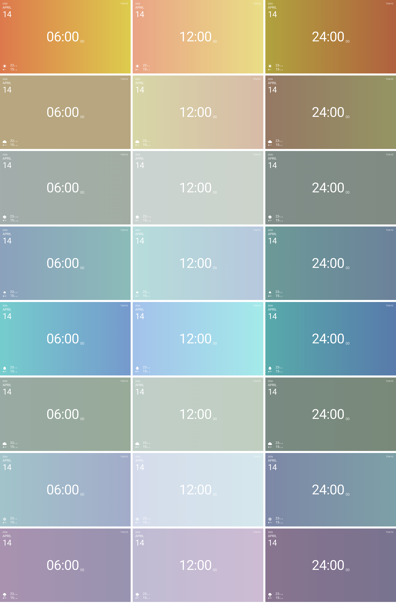

# AirColor Screensaver

AirColor Screensaver brings the outside air into your room through color — shifting with the weather, time of day, and temperature.

Built as a personal tool. If you like it, feel free to use it.
As I use it myself, the design and display may be updated based on my own needs.

[](https://hummergit.github.io/aircolor-screensaver/aircolor.html)

---

## Features

- **Clock** — Current time (HH:MM) with seconds
- **Date** — Year, month, day
- **City** — Auto-detected from your location
- **Weather** — Icon, high/low temperature, difference from yesterday, precipitation probability
- **Dynamic background** — Color changes based on:
  - Weather condition (sunny = warm orange, rain = cool blue, etc.)
  - Time of day (subtle brightness and saturation variation)
  - Temperature (warm/cool white balance shift)
  - Temperature difference from yesterday (left-to-right gradient)
- **Floating particles** — Minimal ambient animation
- **Dynamic favicon** — Browser tab icon updates in real time to match the current background color

---

## Requirements

- macOS
- [WebViewScreenSaver](https://github.com/liquidx/webviewscreensaver)

---

## Installation

**1. Install WebViewScreenSaver**

Download the latest `.dmg` from the [WebViewScreenSaver releases page](https://github.com/liquidx/webviewscreensaver/releases) and install it.

**2. Download the screensaver file**

Download `aircolor.html` from this repository and save it anywhere on your Mac (e.g. `~/Documents/aircolor.html`).

**3. Configure System Settings**

1. Open **System Settings → Screen Saver**
2. Select **WebViewScreenSaver**
3. Click **Options...**
4. Remove the default URL and click **Add URL**
5. Enter the path to the file:
   ```
   file:///Users/YOUR_USERNAME/Documents/aircolor.html
   ```

> **Alternative:** You can also use the GitHub Pages URL directly without downloading the file:
> ```
> https://hummergit.github.io/aircolor-screensaver/aircolor.html
> ```

---

## Windows

On Windows, you can use [Web-Page-Screensaver](https://github.com/cwc/web-page-screensaver) to display AirColor as a screensaver.

1. Download `Web-Page-Screensaver.scr` from the [releases page](https://github.com/cwc/web-page-screensaver/releases)
2. Right-click the file → **Install**
3. Open **Screen Saver Settings** and select **Web-Page-Screensaver**
4. Click **Settings...** and enter the URL:

---

## Color Simulator

A browser-based simulator is available to preview and adjust the color system:

**[Open Simulator](https://hummergit.github.io/aircolor-screensaver/simulator.html)**

The simulator lets you:
- Preview all weather × time × temperature combinations
- Adjust weather base colors, brightness curves, and saturation curves
- Open a full-screen preview for each combination
- Copy adjusted values to apply to `aircolor.html`

---

## How It Works

### Background Color System

The background color is composed of four axes:

| Axis | Variable | Effect |
|------|----------|--------|
| 1 | Weather code | Base hue and saturation |
| 2 | Time of day | Lightness and saturation ratio |
| 3 | Current temperature | White balance shift (warm/cool) |
| 4 | Temp diff from yesterday | Left-to-right gradient |

**Weather base colors:**
| Condition | Color | Hex |
|-----------|-------|-----|
| Sunny | Warm orange | `#FAD078` |
| Partly cloudy | Muted yellow | `#DDE4A8` |
| Cloudy | Green-gray | `#CCD8CE` |
| Fog | Cool gray | `#C8D0CC` |
| Rain | Light blue | `#A2D2EC` |
| Snow | Pale blue-gray | `#EBF2F7` |
| Showers | Blue-gray | `#B8C8DC` |
| Storm | Lavender gray | `#D4CCD8` |

### Location Detection

Uses the browser's `navigator.geolocation` API to find your approximate location. The coordinates are only used to fetch weather data from Open-Meteo — nothing is stored or sent elsewhere.

- If location permission is denied, it defaults to Tokyo's weather.
- When using WebViewScreenSaver, a location permission dialog may appear on first launch. Allow it to enable automatic location detection.

---

## Customization

This is an open-source project. Feel free to customize it for your own use.

Some ideas:
- Add your own cities to the `CITIES` array
- Change the weather base colors in `WX_COLORS`
- Adjust the particle count or behavior
- Modify the layout or font sizes

If you've made customizations or found your own way to enjoy it, I'd love to hear about them — feel free to leave a comment or open an issue.

---

## Verified Environments

| Environment | Status | Note |
|-------------|--------|------|
| macOS Sequoia + WebViewScreenSaver 2.x | ✅ | Author's environment |

If you've tested this on your machine, please leave a comment on the [note article](https://note.com/takahummer/n/n12aef5846a5c) or open an issue here. I'll add your environment to the list.

---

## Data Sources & Licenses

| Resource | License | Notes |
|----------|---------|-------|
| [Open-Meteo](https://open-meteo.com/) | CC BY 4.0 | Free weather API, no key required |
| [Roboto](https://fonts.google.com/specimen/Roboto) | Apache 2.0 | Via Google Fonts |
| [Material Icons](https://fonts.google.com/icons) | Apache 2.0 | Via Google Fonts |
| [WebViewScreenSaver](https://github.com/liquidx/webviewscreensaver) | Apache 2.0 | Required separately |

Weather data provided by [Open-Meteo](https://open-meteo.com/).

---

## License

MIT License — see [LICENSE](./LICENSE) for details.

You are free to use, modify, and distribute this project.
No warranty is provided. The author only guarantees operation in their own environment.

---

## Support

This project is free and maintained in my spare time.
If you find it useful, you can support me on [note](https://note.com/).
No pressure — enjoy the screensaver.
